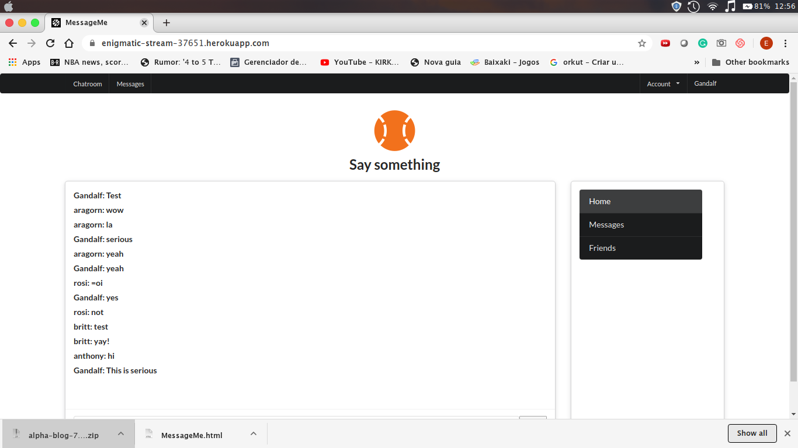

# Message me app - Using ruby on rails

- This is a simple web chat app that alows an user to Sign up and Sign in, has restrictions depending if the user is or not signed in.

## First Page

## Built With

- Ruby on Rails
- Semantiv UI
- Javascript

## Live Demo

[Live Demo Link](https://enigmatic-stream-37651.herokuapp.com/)

### Prerequisites

Having a web browser, code editor and git.

### Install

Just fork it and open in your browser and are good to go.

## Author

👤 **Expedito Andrade**

- Github: [@githubexpjazz](https://github.com/expjazz)
- Twitter: [@expjazz](https://twitter.com/expeditoandrade13)
- Linkedin: [Expedito Andrade](https://www.linkedin.com/in/expedito-andrade-3645151a4/)
- Email: (expeditojazz@gmail.com)

## 🤝 Contributing

Contributions, issues and feature requests are welcome!

Feel free to check the [issues page](issues/).

## Show your support

Give a ⭐️ if you like this project!

## Credits

- Design Created by Mather Njuguna and Sam Achola on behance.
- See the Design Template on behance

## 📝 License

This project is [MIT](./LICENSE) licensed.
